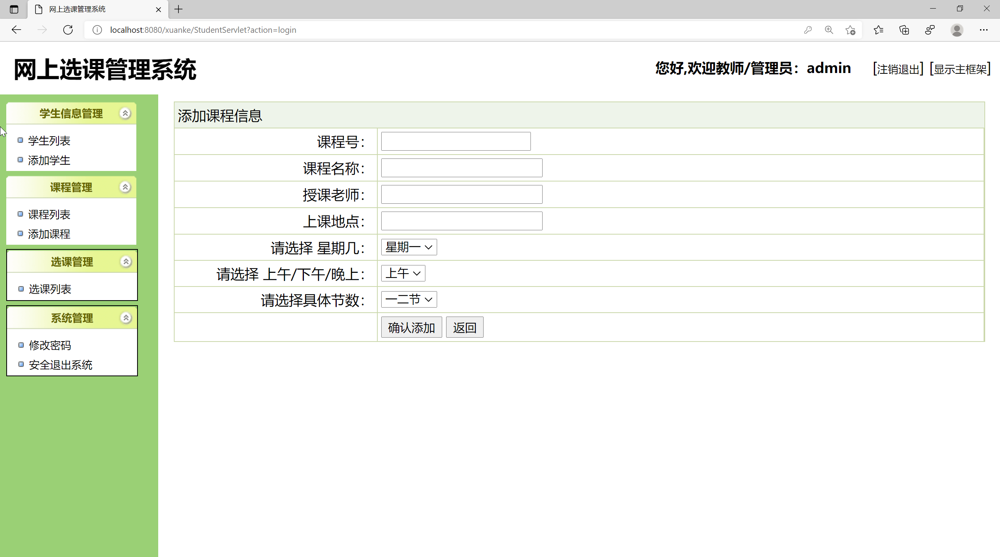
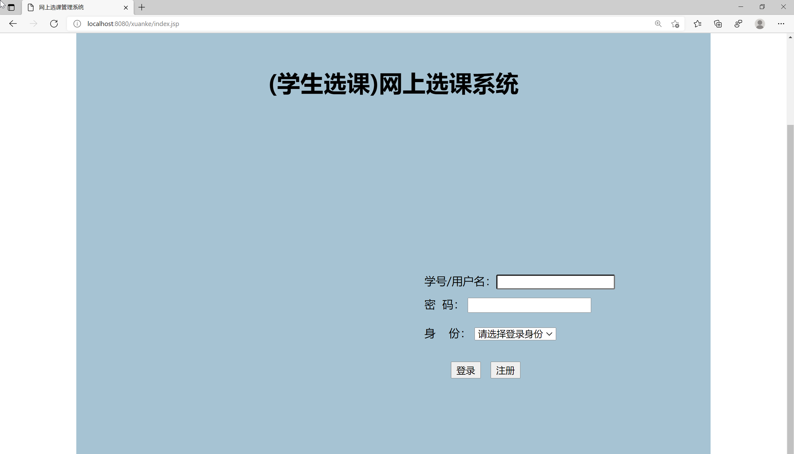
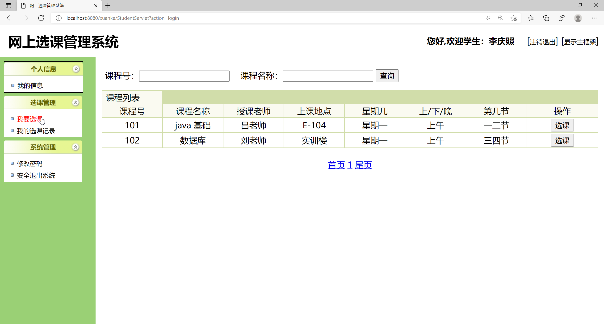
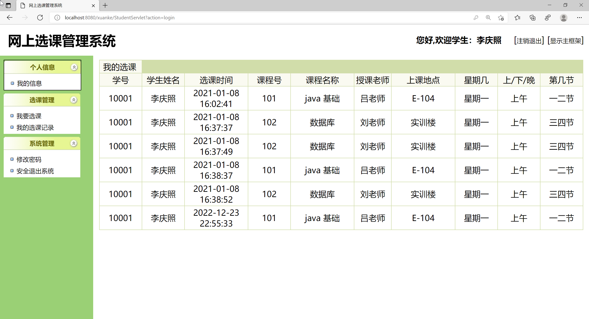

## 基于JSP+Servlet实现的网上选课系统

###  获取sql数据库文件: 从戎源码网 (https://armycodes.com/) QQ: 386869957 QQ群: 377586148
###  所有系统地址: (https://github.com/YuLin-Coder/AllProjectCatalog) 
###  所有项目以及源代码本人均调试运行无问题 可支持远程安装部署调试、定制修改、代码讲解

## 项目介绍
基于JSP+Servlet实现的网上选课系统，主要功能如下

【管理员】
学生信息管理：学生列表，添加学生
课程管理：课程列表，添加课程
选课管理：选课列表
系统管理：修改密码，安全退出系统

【学生】
个人信息：我的信息
选课管理：我要选课，我的选课记录
系统管理：修改密码，安全退出系统

## 项目技术
- 编程语言：Java
- 数据库：MySQL
- 前端技术：JSP、JavaScript、bootstrap、JQuery
- 后端技术：Servlet、JDBC

## 运行环境
- JDK版本：JDK1.8及以上
- 开发工具：IDEA、Ecplise、Myecplise都可以
- 数据库: MySQL5.7及以上

## 运行截图

